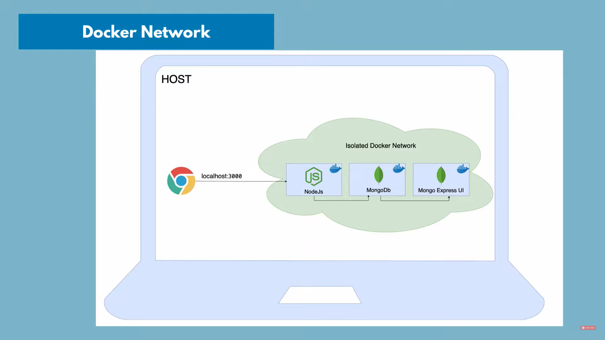

# Docker Network

<br/>


On local machine, Docker runs in an isolated Docker network. Suppose we have two containers running in this network, MongoDB and Mongo Express UI.

Because they are running in the same network, they can communicate with each other just by their container_name, without the localhost, or port numbers.

Suppose there is also an external Node.js application running outside the Docker network _will_ need the localhost:PORT to connect.

After deploying our app, the browser will connect to our
Docker container (also containing the Node.js application) using the localhost:PORT in a similar fashion



Commands:

- `docker network ls`
  Lists Docker networks
- `docker network create mongo-network` to create a new network

```bash
  docker run -d \
  -p 27017:27017 \
  -e MONGO_INITDB_ROOT_USERNAME=admin \
  -e MONGO_INITDB_ROOT_PASSWORD=password \
  --name mongo-latest \
  --network mongo-network \
  mongo
```

> [!INFO]
>
> - 27017 is the default port of MongoDB
> - Environment variables (-e flag) overwrites the default username and password
